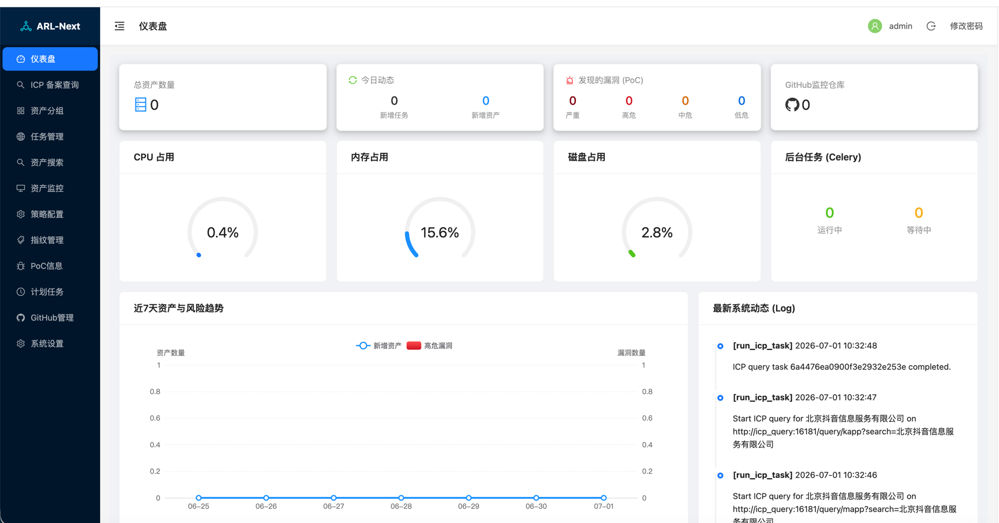
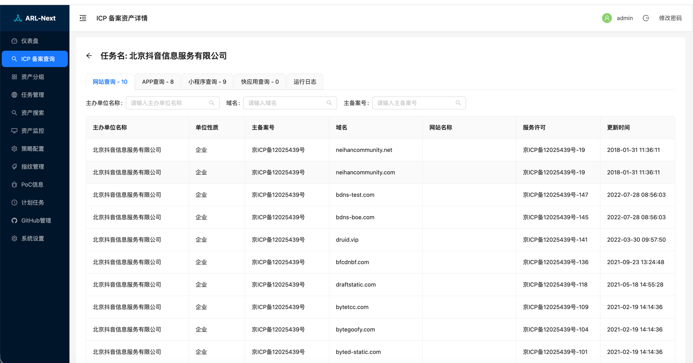
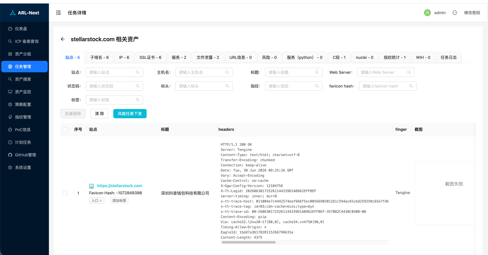
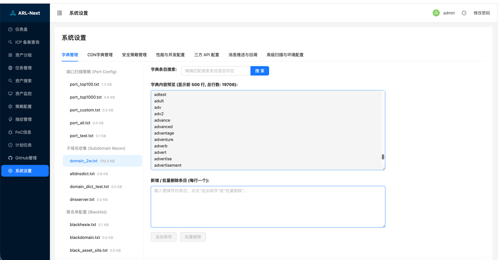

<div align="center">

  # ARL-Next
  **自动化资产侦察与漏洞监控平台**

  <p>
    <a href="https://hub.docker.com/"></a>
    
    
  </p>
</div>

<br/>

---

## 💡 什么是 ARL-Next？

**ARL-Next** 是一款专为企业安全团队与红蓝对抗工程师打造的**下一代自动化资产侦察与漏洞监控平台**。

通过全栈容器化与现代化重构，它彻底告别了传统安全工具环境配置繁琐、部署困难的历史包袱。从资产拓扑发现、指纹识别到漏洞打点，ARL-Next 致力于提供**开箱即用、丝滑流畅**的全局安全态势感知体验。


### 🌟 为什么要重构 ARL-Next？

核心驱动力是**打造一个现代化、低门槛的二次开发 Baseline**：

* **极简二开与 AI 友好（前端重构为主）**：全面拥抱 Vue 3。清晰解耦的代码结构，极大地降低了二次开发门槛，**非常适合直接由 AI 辅助进行功能魔改与研究**。
* **底层引擎换代**：彻底淘汰已停更的 PhantomJS 等老旧组件，平滑迁移至 Chromium + Puppeteer，并升级最新漏洞引擎。
* **开发环境解耦**：后端与中间件全面 Docker 化，前端本地独立运行。告别繁琐的依赖配置，开发者可 100% 聚焦业务逻辑本身。

---

## 📸 界面预览

* **全局仪表盘**：直观展示资产与任务状态分布、近期日志,掌控全局安全态势。
  <br><br>

* **ICP 备案查询**：内置ICP网站、APP、小程序、快应用查询工具，快速获取企业资产边界信息,支持一键同步资产自动下发资产采集、nuclei、POC策略。
  <br><br>

* **任务管理**：精细化的任务下发与状态追踪，支持多维度过滤。
  <br><br>

* **系统设置**：支持热更扫描配置、调整并发与通知推送。
  <br><br>

---

## ✨ 核心特性

* **Nuclei v3 漏洞引擎**：内置 Nuclei v3.3.0 及最新漏洞模板，支持分类扫描，并对接 FOFA 等第三方资产引擎，实现自动化漏洞探测。
* **ICP 备案资产查询**：新增专属查询模块，在平台内即可直接查询目标企业 ICP 备案信息并落库，打通资产发现的起始环。
* **全局可视化仪表盘**：全景监控资产总量（域名 / IP / 站点）、任务执行状态及系统实时负载，支持系统日志自动轮转。
* **高度自定义系统设置**：支持在 Web 界面直接热更扫描字典、自定义端口探测范围，并可配置钉钉、飞书、企业微信等即时消息推送。
* **统一 GitHub 监控面板**：将 GitHub 任务列表与监控列表合并为统一的管理界面，操作更直接高效。

---

## 🏗️ 架构设计

ARL-Next 采用清晰的微服务架构设计，各模块职责明确：

1. **展示层 (Frontend)**：基于 Vue 3 + Vite 构建，负责用户交互与数据可视化。
2. **业务 API 层 (Backend)**：基于 Flask，负责接收前端指令、鉴权，并调度底层任务。
3. **消息中间件 (Broker)**：采用 **RabbitMQ**，负责高效可靠地分发并解耦庞大的异步扫描任务。
4. **异步执行层 (Workers)**：Celery 分布式集群（含普通 worker、github 监控、定时调度器），专门执行耗时的漏洞扫描和资产收集。
5. **持久化存储 (Database)**：使用 **MongoDB**，承载海量扫描结果与大宽表资产数据的落地。

---

## 🚀 部署指南

### 方案 A：前端本地 + Docker 后端源码部署 (推荐开发者使用)

**适用场景**：调试前端 UI、修改后端接口逻辑。后端所有服务（核心 API / Celery Worker / Scheduler / 数据库 / 消息队列）运行在 Docker 中（**整库卷挂载，修改代码即时生效**），前端在本地以 Vite 开发服务器运行，通过代理透传请求。

> **前置条件**：已安装 [Docker Desktop](https://www.docker.com/products/docker-desktop/) 和 [Node.js](https://nodejs.org/)（附带 npm），并全局安装 pnpm：`npm install -g pnpm`

---

#### 第一步：构建并启动后端开发环境

```bash
# 克隆代码
git clone https://github.com/owl234/ARL-Next
cd ARL-Next

# 首次构建后端开发镜像（内置所需底层引擎，耗时约 10~20 分钟）
# 此后只要 Dockerfile.dev 不变，无需重复 build
docker-compose -f docker-compose.dev.yml build arl-dev

# 一键启动全部后台服务
docker-compose -f docker-compose.dev.yml up -d
```

> **说明**：
> 1. `docker-compose.dev.yml` 会将本地项目目录挂载入容器，修改后端 Python 代码后，服务会自动热重载。
> 2. 容器启动时会自动重置/注入默认管理员账号，账号密码为：`admin` / `arlpass`。
> 3. 容器内的服务已为您自动映射好宿主机端口（API -> `5001`，Mongo -> `27018`，RabbitMQ -> `5673`），完全不影响本地环境。

---

#### 第二步：确认前端 API 代理配置

后端 API 默认映射到宿主机 `5001` 端口。请确认 `frontend/vite.config.js` 中的代理指向正确：

```js
// frontend/vite.config.js
proxy: {
  '/api': {
    target: 'http://127.0.0.1:5001', 
    changeOrigin: true,
  }
}
```

---

#### 第三步：启动前端开发服务器

```bash
cd frontend

# 首次安装依赖
pnpm install

# 启动 Vite 开发服务器（支持热重载）
pnpm run dev
```

启动后访问控制台打印的本地地址（默认 `http://localhost:5173`，若端口占用则顺延）即可登录系统。

> **HTTPS 证书（可选）**：如需开启 HTTPS 以避免浏览器的各种安全拦截（如 Web Worker 限制等），可使用 `mkcert localhost` 生成本地证书，并将 `localhost.pem` 与 `localhost-key.pem` 放置于项目根目录 `certs/` 下，Vite 开发服务器检测到后会自动读取并开启 HTTPS (`https://localhost:5173`)。

---

#### 常用开发管理命令

```bash
# 查看所有容器状态
docker-compose -f docker-compose.dev.yml ps

# 实时查看后端主服务（API、Worker、定时任务）的混合日志
docker-compose -f docker-compose.dev.yml logs -f arl-dev

# 停止开发环境（不丢失数据）
docker-compose -f docker-compose.dev.yml down
```

---

## 🗄️ 数据库直连指引 (可选)

开发期间如需直连数据库查看数据，可使用以下参数（如果是通过 Docker 启动，需确保暴露了相应端口）：

**MongoDB 核心数据库**
* **Host:** `127.0.0.1`
* **Port:** `27018`
* **认证库 (Database):** `admin`
*(业务数据均存储在 `arl` 数据库中)*

**RabbitMQ 消息队列**
* **Host:** `127.0.0.1`
* **Port:** `5673`
* **认证:** `admin` / `admin`

---

## 📅 未来计划 (Roadmap)

* [ ] **撰写完整使用手册**：提供详细的从部署到实战的操作指南。

---

## 🤝 致谢

* **ARL-Next** 是基于开源项目 [ARL (Asset Reconnaissance Lighthouse) 资产侦察灯塔](https://github.com/TophantTechnology/ARL) 进行重构与二次开发的增强版本。
* 本项目集成的 **ICP 备案资产查询** 模块，是基于优秀的开源项目 [ICP_Query](https://github.com/HG-ha/ICP_Query) 进行的二次开发。

我们对原 ARL 开发团队以及 ICP_Query 作者为信息安全开源社区做出的巨大贡献表示最诚挚的感谢！本着开源互助的精神，ARL-Next 将继续遵循开源精神。

---

## ⚠️ 声明与免责

本工具仅面向合法授权的企业安全建设、SRC 漏洞挖掘以及安全研究学术交流。
使用本工具进行资产扫描与漏洞探测时，请务必遵守当地法律法规（如《中华人民共和国网络安全法》）及目标平台的测试范围规定。未经授权对目标进行探测属非法行为。使用者因使用本工具造成的任何直接或间接的法律责任与后果，由使用者自行承担，项目作者及贡献者不负任何连带责任。

---

## 💬 问题反馈与交流

在使用过程中如遇到 Bug、有新的功能建议，或是想探讨安全开发与红蓝对抗技术，欢迎通过 GitHub Issues 提交反馈。

同时也欢迎通过以下微信与我联系交流：

<div align="center">


</div>

---

## 🌟 Star History

**⭐ 如果本项目为你的安全工作带来了便利，不妨点个 Star 支持一下！**

<div align="center">

<a href="https://github.com/owl234/arl-next/stargazers">
  
</a>

<br/>

[](https://star-history.com/#owl234/arl-next&Date)

</div>
