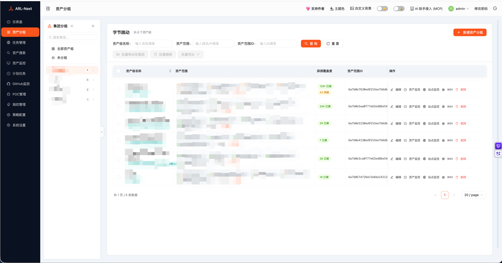
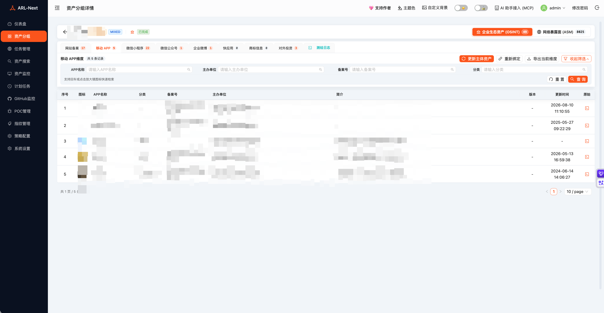
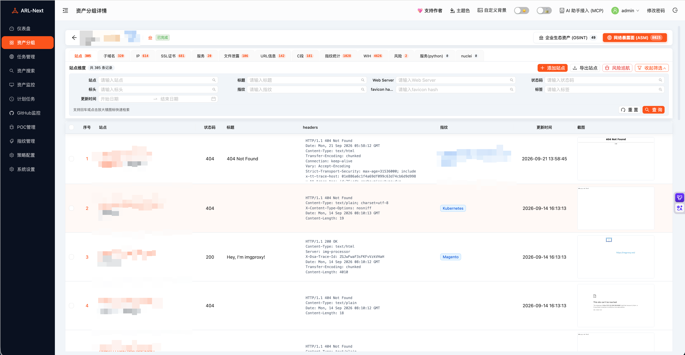
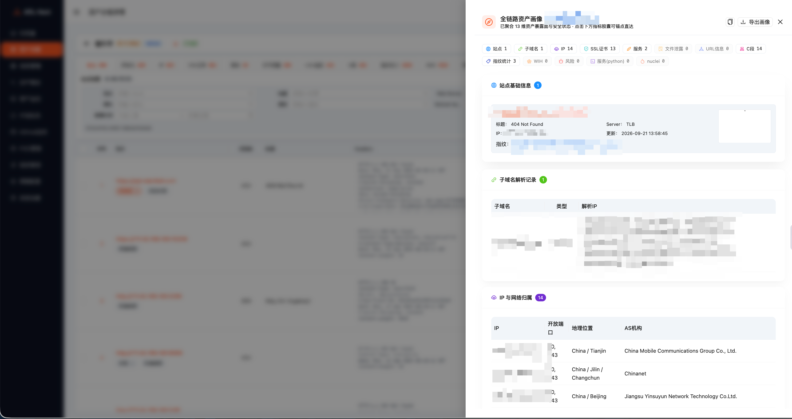
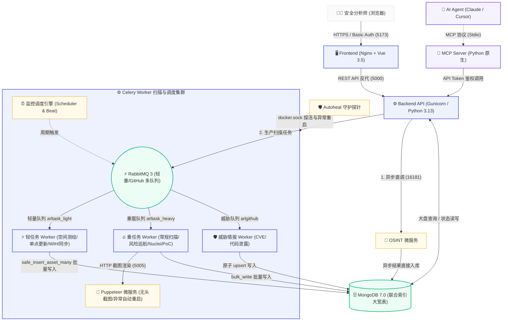

<div align="center">

  # ARL-Next
  **现代化资产测绘与漏洞监控平台**

  *Modern Attack Surface Reconnaissance & Asset Intelligence Platform*

  <p><b>企业资产关联 · 异步解耦调度 · 原生 MCP 协议集成 · 容器化开箱部署</b></p>

  <p>
    <a href="https://github.com/owl234/ARL-Next/releases"></a>
    <a href="https://github.com/owl234/ARL-Next/stargazers"></a>
    <a href="https://github.com/owl234/ARL-Next/network/members"></a>
    <a href="./LICENSE"></a>
  </p>

  <p>
    
    
    
    
    
    
  </p>

  <p>
    <a href="#quick-deploy"><b>⚡ 快速部署指南</b></a> •
    <a href="#comparison"><b>💡 架构演进对比</b></a> •
    <a href="#core-features"><b>✨ 核心特性</b></a> •
    <a href="./mcp-server/README.md"><b>🤖 MCP配置指南</b></a> •
    <a href="./CHANGELOG.md"><b>📜 更新日志</b></a> •
    <a href="./LICENSE"><b>📄 开源协议</b></a>
  </p>
</div>

<br/>

---

## 💡 什么是 ARL-Next？

> **ARL-Next** 是基于经典开源项目 ARL (资产侦察灯塔) 进行架构重构与持续演进的资产测绘平台。
> 针对大规模扫描场景下的任务队列阻塞、长时间运行内存增长以及历史依赖过时等工程瓶颈，系统实施了微服务拆分与异步任务解耦，全面升级现代运行时环境与测绘工具链，并集成了 **Model Context Protocol (MCP)** 标准协议，支持自动化资产透视与 AI 协同分析。

---

### <span id="comparison"></span>💡 架构演进与技术方案基准对比

| 评估维度 | ARL 原始架构与实现 | ARL-Next 重构方案 |
| :--- | :--- | :--- |
| **并发与调度架构** | 任务执行共用单 Celery 队列，复杂任务高并发时易发生队列阻塞与假死 | **拆分 OSINT 与截图为独立微服务**，引入轻重分离队列与批量落库，显著收敛队列阻塞与并发瓶颈 |
| **自动化协议集成** | 无标准化外部调度接口，仅支持 Web 控制台人工交互 | **内置原生 MCP Server**，支持通过标准协议进行 13 维全景资产画像检索与统计分析 |
| **企业资产拓扑** | 无关联企业与全类型数字资产下钻链路 | **资产分组融合管理**：支持企业股权关联与全类型 ICP 检索（网站 / APP / 小程序 / 快应用），构建多级集团拓扑与全景暴露面画像 |
| **容器构建与部署** | 依赖陈旧且缺乏镜像加速，构建拉取易受外部网络波动影响 | **多阶段容器构建与阿里云国内镜像源预编译**，提升构建速度与部署稳定性 |
| **底层技术栈基线** | Python 3.6 / Vue 2 / MongoDB 3.x / Nmap 7.70 | **Python 3.13 / Vue 3.5 / MongoDB 7.0 / Nmap 7.95 稳定版** 现代运行环境基线全面对齐 |
| **敏感信息提取** | 基于外部 Go 二进制工具，跨平台存在依赖与编译维护成本 | **纯 Python 原生提取引擎**，无外部二进制依赖，支持敏感凭证与信息的流式提取 |
| **Web 交互体验** | 大数据长列表无固定表头，分页状态未持久化，字典与策略配置分散于多级子菜单 | **表头与操作栏 Sticky 悬浮吸附**、分页状态本地持久化、三栏式字典管理器 |
| **威胁情报协同** | 缺乏持续情报同步机制，时间戳处理不统一易产生冗余告警 | **CVE 与 GitHub 代码泄露监听**、基于数据库原子更新锁去重、严格时区归一化 |

---

### <span id="core-features"></span>✨ 核心特性矩阵

* 🤖 **MCP 标准协议集成**：内置基于 Python 标准库的原生 MCP 服务，支持外部 Agent 对接检索 13 维全景资产画像与统计大盘数据（任务下发与策略调度能力持续接入中）。（👉 [MCP 配置指南](./mcp-server/README.md)）
* ⚙️ **异步解耦并发调度**：微服务拆分与独立任务队列分流，结合批量数据落库优化，保障高吞吐扫描平稳运行。
* 🌐 **多级资产分组与全维融合**：企业资产查询深度融入资产分组管理架构，支持集团多级架构管理、全类型 ICP 与生态资产自动化关联及网络暴露面统一测绘。
* 🔍 **现代资产测绘基准**：基于 Nmap 7.95 稳定版；内置原生 Python 敏感凭据与信息流式提取引擎。
* 🛡️ **漏洞与代码泄露监控**：持续同步权威 CVE 漏洞情报，监听 GitHub 关联代码与凭据泄露，支持基于原子更新的去重机制。
* ⚡ **高可用运维与容错机制**：集成容器健康探活、就绪轮询与异常自动重启机制，支持管理后台在线平滑升级。
* 📦 **预构建镜像加速**：提供阿里云国内镜像源预编译构建制品，规避跨国网络波动导致的镜像拉取与依赖安装失败。

---

## 📸 界面预览

* **全局仪表盘 (Dashboard)**：实时呈现资产暴露面态势、今日侦察动向、漏洞风险矩阵与威胁情报；集成系统资源占用（CPU/内存/磁盘）与扫描调度队列监控、风险演进趋势分析、全景安全调度日志流、Web 组件指纹 TOP 5 分布及实时侦察流水线追踪。
  
  <p align="center">
    
  </p>

<details open>
<summary><b>🖼️ 点击收起 / 展开更多核心业务界面</b></summary>

<br/>

* **多级资产分组与全景资产画像**：原企业资产查询现已深度整合至资产分组统一架构。支持集团多级组织架构管理、企业生态资产关联分析 (OSINT)、网络暴露面测绘 (ASM) 与 13 维全景资产画像下钻。
  
  <p align="center">
    
  </p>
  
  <p align="center">
    
  </p>
  
  <p align="center">
    
  </p>
  
  <p align="center">
    
  </p>

* **任务下发与策略调度**：深度联动 Nuclei、100+ 专属漏洞 PoC 插件池及近万级 Web 指纹库 (8800+)，支持全生命周期下发与追踪。
  
  <p align="center">
    
  </p>
  
  <p align="center">
    
  </p>

* **威胁情报与代码泄露雷达**：实时追踪全球最新 CVE 漏洞，自动化监听 GitHub 敏感代码与凭证泄露。
  
  <p align="center">
    
  </p>

* **系统设置与现代字典管理**：全新现代三栏式字典管理（支持在线预览/呼吸灯提示）、队列并发热扩缩容及告警通道。
  
  <p align="center">
    
  </p>

</details>

---

## 🏗️ 架构设计

ARL-Next 采用前后端解耦、异步分布式任务队列与轻量微服务集群架构。整体数据流与模块交互如下：


```mermaid
graph TD
    %% 1. 接入层
    User["👨‍💻 安全分析师 (浏览器)"] -->|"HTTPS / Basic Auth (5173)"| Nginx["🖥️ Frontend (Nginx + Vue 3.5)"]
    Agent["🤖 AI Agent (Claude / Cursor)"] -.->|"MCP 协议 (Stdio)"| MCP["🤖 MCP Server (Python 原生)"]

    %% 2. API 网关层
    Nginx -->|"REST API 反代 (5000)"| Backend["⚙️ Backend API (Gunicorn / Python 3.13)"]
    MCP -->|"API Token 鉴权调用"| Backend

    %% 3. 调度与任务分流 (双轨解耦)
    Backend -->|"1. 异步直调 (16181)"| OSINT["🧩 OSINT 微服务"]
    Backend -->|"2. 生产扫描任务"| MQ(("⚡ RabbitMQ 3 (轻重/GitHub 多队列)"))

    %% 4. Celery Worker 扫描计算集群
    subgraph WorkerCluster ["⚙️ Celery Worker 扫描与调度集群"]
        MQ -->|"轻量队列 arltask_light"| W_Light["⚡ 轻任务 Worker (空间测绘/单点更新/WIH/同步)"]
        MQ -->|"重载队列 arltask_heavy"| W_Heavy["🔥 重任务 Worker (常规扫描/风险巡航/Nuclei/PoC)"]
        MQ -->|"威胁队列 arlgithub"| W_Git["🛡️ 威胁情报 Worker (CVE/代码泄露)"]
        
        Scheduler["⏰ 监控调度引擎 (Scheduler & Beat)"] -.->|"周期触发"| MQ
        W_Heavy -->|"HTTP 截图渲染 (5005)"| Puppeteer["🧩 Puppeteer 微服务 (无头截图/异常自动重启)"]
    end

    %% 5. 数据统一落库 (从上往下自然汇聚分流)
    Backend <-->|"大盘查询 / 状态读写"| DB[("🗄️ MongoDB 7.0 (联合索引大宽表)")]
    OSINT -->|"异步结果直接入库"| DB
    W_Light -->|"safe_insert_asset_many 批量写入"| DB
    W_Heavy -->|"bulk_write 批量写入"| DB
    W_Git -->|"原子 upsert 写入"| DB

    Autoheal["🛡️ Autoheal 守护探针"] -.->|"docker.sock 探活与异常重启"| WorkerCluster

    classDef default fill:#fbfbfb,stroke:#e0e0e0,stroke-width:1px;
    classDef core fill:#eef2ff,stroke:#6366f1,stroke-width:2px;
    classDef ai fill:#f5f3ff,stroke:#8b5cf6,stroke-width:2px;
    classDef db fill:#ecfdf5,stroke:#10b981,stroke-width:2px;
    classDef micro fill:#fffbeb,stroke:#f59e0b,stroke-width:1px;
    
    class Nginx,Backend,WorkerCluster,W_Light,W_Heavy,W_Git core;
    class Agent,MCP ai;
    class DB,MQ db;
    class OSINT,Puppeteer,Autoheal,Scheduler micro;
```

### 核心架构要点：

1. 🖥️ **展示与网关 (Frontend / Nginx)**：基于 **Vue 3.5 + Nginx**，支持全站表格与操作栏 **Sticky 悬浮吸附**及 **Basic Auth 前置网关防护**。
2. ⚙️ **业务与协议接入 (Backend / MCP)**：基于 **Python 3.13 + Gunicorn**；内置 **原生 Python MCP** 服务，提供标准协议接口与 13 维全景资产画像导出能力。
3. 🧩 **OSINT 独立微服务**：专职企业资产与 ICP 异步情报采集，由 Backend 直调协程池，**独立于 Celery 扫描队列以规避长耗时任务阻塞**。
4. ⚡ **多队列 Worker 集群**：划分**轻量/重载/威胁情报**独立队列；通过 Worker 子进程生命周期轮转机制控制内存增长；**测绘执行引擎统一至 Nmap 7.95 稳定版**。
5. 🛡️ **微服务与守护探针 (Puppeteer / Autoheal)**：无头截图容器化隔离并支持请求计数轮转；**Autoheal 守护进程定时探活扫描 Worker 并自动重启异常容器**；纯 Python 引擎高效提取敏感信息。
6. 🗄️ **高吞吐持久层与并发优化 (MongoDB 7.0)**：数据写入全面迁移至 `bulk_write` 批量接口，核心集合覆盖联合唯一索引并设 1GB 内存池保护；解除不合理的内存硬限制，保障高吞吐扫描平稳性。

---

## <span id="quick-deploy"></span>🚀 部署指南

### 生产部署 (推荐)

**适用环境**：公网云服务器 (Ubuntu / Debian / CentOS / 统信等)、企业内网服务器。  
**预估耗时**：自带 Docker 环境约需 **1~2 分钟**；全新裸机从零安装约 **3~5 分钟**。

**核心机制与优势**：
* ⚡ **国内镜像加速**：直连阿里云国内镜像私库，规避跨国网络超时与拉取阻断。
* 📦 **开箱即用**：预构建交付，无需在宿主机配置复杂编译链与工具库。
* 🛡️ **双层安全防护**：内置 SSL 证书与 **Basic Auth 前置网关防护**，核心组件全私有网络隔离。
* 🔄 **后台平滑热更**：支持直接在管理后台一键触发升级流程，自动同步编排脚本与最新镜像。
* 🩺 **服务健康探活**：内置 API 就绪轮询机制与内存防护配置，服务就绪再放行，保障启动稳定性。

---

#### 🚀 部署方式选择

##### 方法一：国内镜像快速部署（推荐 · 规避 GitHub 网络波动）

在服务器终端 (需 root 权限) 粘贴并执行对应系统的连缀指令。脚本将从阿里云国内镜像提取全套部署编排，并自动配置 Swap、安装/补齐 Docker 与 Compose 插件后一键拉起：

> [!TIP]
> `start-prod.sh` 内置全套环境探针，支持自动安装 Docker、补齐 Docker Compose 插件并调优内核，裸机亦可顺畅运行。

**Ubuntu / Debian / 统信 系统**：
```bash
# 1. 安装基础工具并创建目录
apt-get update && apt-get install -y docker.io openssl curl && \
(systemctl enable --now docker 2>/dev/null || service docker start 2>/dev/null || true) && \
mkdir -p ~/ARL-Next && cd ~/ARL-Next && \
# 2. 从阿里云国内镜像提取全套部署编排并启动
docker pull crpi-laul1izptqrf0tkf.cn-beijing.personal.cr.aliyuncs.com/owl234-arl-prod/arl-web:latest && \
docker rm -f arl-temp 2>/dev/null || true && \
docker create --name arl-temp crpi-laul1izptqrf0tkf.cn-beijing.personal.cr.aliyuncs.com/owl234-arl-prod/arl-web:latest && \
docker cp arl-temp:/code/start-prod.sh ./ && \
docker cp arl-temp:/code/docker-compose.prod.yml ./ && \
docker cp arl-temp:/code/updater ./ && \
docker cp arl-temp:/code/version.txt ./ && \
docker cp arl-temp:/code/CHANGELOG.md ./ && \
mkdir -p ./frontend && docker cp arl-temp:/code/frontend/default.conf.prod ./frontend/ && \
docker rm -f arl-temp && \
chmod +x start-prod.sh && bash start-prod.sh
```

**CentOS / RHEL / Alibaba Cloud Linux / TencentOS 系统**：
```bash
# 1. 安装基础工具、自动补齐 Docker 并创建目录
yum install -y openssl curl && \
(command -v docker &>/dev/null || curl -fsSL https://get.docker.com | bash -s docker --mirror Aliyun) && \
systemctl enable --now docker 2>/dev/null || true && \
mkdir -p ~/ARL-Next && cd ~/ARL-Next && \
# 2. 从阿里云国内镜像提取全套部署编排并启动
docker pull crpi-laul1izptqrf0tkf.cn-beijing.personal.cr.aliyuncs.com/owl234-arl-prod/arl-web:latest && \
docker rm -f arl-temp 2>/dev/null || true && \
docker create --name arl-temp crpi-laul1izptqrf0tkf.cn-beijing.personal.cr.aliyuncs.com/owl234-arl-prod/arl-web:latest && \
docker cp arl-temp:/code/start-prod.sh ./ && \
docker cp arl-temp:/code/docker-compose.prod.yml ./ && \
docker cp arl-temp:/code/updater ./ && \
docker cp arl-temp:/code/version.txt ./ && \
docker cp arl-temp:/code/CHANGELOG.md ./ && \
mkdir -p ./frontend && docker cp arl-temp:/code/frontend/default.conf.prod ./frontend/ && \
docker rm -f arl-temp && \
chmod +x start-prod.sh && bash start-prod.sh
```

##### 方法二：GitHub 源码克隆部署（适用于海外服务器 / 源码部署）

> [!TIP]
> `start-prod.sh` 内置全套环境探针，裸机运行亦会自动安装 Docker 并优化内核配置。

```bash
git clone --depth 1 https://github.com/owl234/ARL-Next.git && cd ARL-Next
chmod +x start-prod.sh
bash start-prod.sh
```

---

#### 🔑 访问与初始凭据

部署完成后，在浏览器中访问：`https://<你的服务器IP>:5173`（首次自签名证书请无视浏览器不安全提示）。

| 验证层级 | 默认账号 | 默认密码 | 说明 |
| :--- | :--- | :--- | :--- |
| **第一层：Nginx Basic Auth 网关** | `admin` | `arl_next` | 前置防扫描器爆破（默认关闭，可在顶部导航栏通过安全开关一键热开启或关闭，修改密码可在关闭后重新开启配置） |
| **第二层：ARL-Next 系统登录** | `admin` | `arlpass` | 平台主账号，首次登录后建议立即修改 |

> [!TIP]
> - **网络与防火墙开放**：请确保云服务器控制台安全组及系统本地防火墙（如 `ufw allow 5173/tcp` 或 `firewall-cmd --permanent --add-port=5173/tcp && firewall-cmd --reload`）已放行 **5173** TCP 端口。
> - **商业证书替换 (可选)**：将您申请的真实 SSL 证书重命名为 `arl.crt` 和 `arl.key` 放至 `ssl-certs/` 目录，然后再次执行 `bash start-prod.sh` 即可。

---

### 🔄 生产环境版本升级

ARL-Next 支持 **Web 管理后台一键热更新**（在「系统设置」中在线升级）与 **终端标准手动升级**：

#### 方案一：Web 管理后台一键热更新（推荐）

登录 ARL-Next 平台 ➔ 进入 **「系统设置」** 页面 ➔ 点击 **「一键系统更新」**。<br/>
宿主机更新守护进程将自动拉取最新构建、同步最新编排脚本与版本文件，并在后台完成容器热重启与服务就绪检查，全程无需登录终端。

#### 方案二：终端标准手动升级

在服务器终端进入 ARL-Next 部署目录，根据您的初次安装方式执行对应升级命令：

* **Git 源码克隆用户 (方法二部署)**：
  ```bash
  cd ~/ARL-Next && git pull && sudo bash start-prod.sh
  ```

* **免 Git 一键部署用户 (方法一部署)**：
  在终端执行以下连缀指令，重新同步最新的编排脚本并平滑拉起：
  ```bash
  cd ~/ARL-Next && \
  docker pull crpi-laul1izptqrf0tkf.cn-beijing.personal.cr.aliyuncs.com/owl234-arl-prod/arl-web:latest && \
  docker run --rm -v $(pwd):/host crpi-laul1izptqrf0tkf.cn-beijing.personal.cr.aliyuncs.com/owl234-arl-prod/arl-web:latest bash -c "cp /code/start-prod.sh /host/start-prod.sh && cp /code/docker-compose.prod.yml /host/docker-compose.prod.yml && mkdir -p /host/updater && cp -r /code/updater/. /host/updater/ 2>/dev/null || true; mkdir -p /host/frontend && cp /code/frontend/default.conf.prod /host/frontend/default.conf.prod 2>/dev/null || true; cp /code/version.txt /host/version.txt 2>/dev/null || true; cp /code/CHANGELOG.md /host/CHANGELOG.md 2>/dev/null || true" && \
  sudo bash start-prod.sh
  ```

> [!TIP]
> **升级保障机制**：
> - **数据增量平滑迁移**：内置版本增量迁移逻辑，自动维护集合结构与联合唯一索引，降低升级冲突风险。
> - **运行镜像备份标签**：升级前自动为当前运行的服务镜像（Web、Worker、Puppeteer、OSINT等）打上 `backup-stable` 标签，保障异常时可快速回滚。
> - **镜像加速与就绪探针**：直连阿里云国内镜像仓库拉取构建制品，API 动态探活就绪后再行放行。

---

## ❓ 常见问题与运维排错 (FAQ)

<details open>
<summary><b>Q1: 首次通过 HTTPS 访问时，浏览器提示“不安全 / 您的连接不是私密连接”？</b></summary>
<br/>

**A:** 系统首次启动时会自动签发本地自签名 SSL 证书。
- 点击浏览器页面的 **“高级” ➔ “继续前往 (不安全)”** 即可正常访问（Chrome 浏览器亦可在页面任意空白处直接键盘盲打 `thisisunsafe` 跳过警告）。
- **配置真实域名证书**：将您申请的证书重命名为 `arl.crt` 和 `arl.key` 放至 `ssl-certs/` 目录，执行 `bash start-prod.sh` 即可无缝切换。
</details>

<details>
<summary><b>Q2: 忘记系统登录密码或 Basic Auth 防爆破凭证怎么办？</b></summary>
<br/>

**A:** 在服务器终端执行以下操作即可一键重置：
- **重置平台管理员账号 (admin / arlpass)**：
  ```bash
  docker exec -it arl-web-prod /code/backend/.venv-docker/bin/python3 /code/backend/inject_user.py --reset
  ```
  > [!NOTE]
  > 平台启动时默认保护现有密码，追加 `--reset` 参数将强制将 `admin` 密码重置为初始密码 `arlpass`。请在宿主机受信环境下执行。
- **重置/查看 Basic Auth 凭据**：编辑工作目录下的 `frontend/.htpasswd`，或登录系统后在顶部导航栏通过安全开关一键热开启/关闭（修改密码可在关闭后重新开启配置）。
</details>

<details>
<summary><b>Q3: 点击 Web 端的“一键系统更新”时，提示 <code>[ERROR]触发更新失败</code>？</b></summary>
<br/>

**A:** 这种情况通常是因为宿主机更新守护进程未响应。您可以通过以下两种方式解决：
- **方式 1 (推荐)：直接在终端执行生产环境标准手动升级**
  ```bash
  cd ~/ARL-Next && sudo bash start-prod.sh
  ```
- **方式 2：重启宿主机更新服务后重试 Web 更新**
  ```bash
  sudo systemctl restart arl-updater.service
  ```
</details>

<details>
<summary><b>Q4: 扫描任务较多时，如何调整系统并发性能？</b></summary>
<br/>

**A:** ARL-Next 支持**动态热调整并发**，无需重启容器！
- 登录平台 ➔ 进入 **「系统设置」** 页面；
- 可视化调整 **轻任务并发数**（空间测绘 / 单点更新 / WIH 提取 / 数据同步）、**重任务并发数**（常规域名 / IP 扫描、风险巡航、Nuclei/PoC 长线任务）及 **OSINT 并发数**，保存后系统将自动热生效。
</details>

<details>
<summary><b>Q5: 常用 Docker 容器维护与日志排查命令速查？</b></summary>
<br/>

```bash
# 查看所有容器运行状态与健康探针
docker compose -f docker-compose.prod.yml ps

# 实时查看扫描 Worker 执行日志
docker compose -f docker-compose.prod.yml logs -f arl-worker

# 平滑停止或重启全部服务
docker compose -f docker-compose.prod.yml restart
```
</details>

---

## 📜 更新日志

详细的版本演进历史、各版本特性与问题修复记录，请参阅 ➔ [**CHANGELOG.md**](./CHANGELOG.md)

---

## 🤝 致谢

本项目站在巨人的肩膀上，特此鸣谢以下项目与团队：

* **核心架构**：基于经典开源项目 [ARL 资产侦察灯塔](https://github.com/TophantTechnology/ARL) 深度重构，并参考了 [Aabyss-Team/ARL](https://github.com/Aabyss-Team/ARL) 与 [adysec/ARL](https://github.com/adysec/ARL) 等优秀实践。
* **指纹数据**：特别鸣谢 **威零安全团队** ( 公众号) 提供的万级高质量 Web 指纹库支撑。
* **功能灵感**：OSINT 企业查询深度借鉴了 [ICP_Query](https://github.com/HG-ha/ICP_Query)，威胁监控模块汲取了 [github-cve-monitor](https://github.com/yhy0/github-cve-monitor) 的优雅设计。

ARL-Next 将始终秉持开源互助的黑客初心，持续为网络安全攻防与企业防御建设贡献力量！

---

## 💖 赞助与支持

ARL-Next 的持续高频迭代离不开社区伙伴的慷慨支持。特别致谢以下赞助者：

<p align="center">
  
</p>

<p align="center">
  <a href="https://github.com/robotfish001" target="_blank">
    
  </a>
  <a href="https://github.com/phpmac" target="_blank">
    
  </a>
  <a href="https://github.com/123lpone" target="_blank">
    
  </a>
  <a href="https://github.com/Qexzi" target="_blank">
    
  </a>
</p>

---

## ⚠️ 法律与免责声明

> [!CAUTION]
> **合规红线与免责条款**：  
> 本平台仅供经过合法授权的企业安全建设、SRC 漏洞挖掘、学术攻防演练及安全研究使用。使用本工具开展任何探测与扫描前，使用者必须确保已获得目标资产所有者的明确书面授权，并严格遵守《中华人民共和国网络安全法》及当地法律法规。  
> **严禁利用本工具从事任何未授权的入侵、攻击或破坏行为！** 任何因违规滥用导致的网络安全事故或法律责任，均由使用者本人独立承担，本项目作者与贡献者不承担任何直接或连带责任。

---

## 📄 开源协议 (License)

ARL-Next 项目遵循 [GNU General Public License v3.0 (GPL-3.0)](./LICENSE) 开源许可证协议。

* 🆓 **自由与开源**：您可以免费用于企业自建、安全研究、资产测绘与攻防演练，并享有自由阅读、修改与定制源码的权利。
* 🌐 **传染与同协议共享**：若您在二次开发中修改或基于本项目构建衍生作品并向第三方分发，必须保持在相同的 GPL-3.0 许可证下完整开源相关代码。
* ⚖️ **署名与免责保留**：任何形式的源码复制与再分发，均须保留原始作者版权声明、许可证全文以及免责条款。

---

## 💬 交流群与反馈通道

- 🐛 **Bug 提交与功能建议**：欢迎通过 [GitHub Issues](https://github.com/owl234/ARL-Next/issues) 提交反馈，通常 24 小时内跟进。
- 💡 **技术交流与群聊**：欢迎扫码添加作者微信或加入 QQ 交流群，探讨资产测绘、红蓝对抗与 AI 自动化安全。
- 📢 **版本发布动态**：欢迎关注微信公众号【**owl安全**】，获取版本迭代说明、架构解析与更新通知。

<table align="center">
  <tr>
    <td align="center" style="padding: 10px 25px;"><b>👤 个人微信</b></td>
    <td align="center" style="padding: 10px 25px;"><b>📢 微信公众号 (owl安全)</b></td>
    <td align="center" style="padding: 10px 25px;"><b>🐧 QQ 技术交流群</b></td>
  </tr>
  <tr>
    <td align="center" style="padding: 10px 25px;"></td>
    <td align="center" style="padding: 10px 25px;"></td>
    <td align="center" style="padding: 10px 25px;"></td>
  </tr>
</table>

---

## 🌟 Star History

<div align="center">

<a href="https://www.star-history.com/?repos=owl234%2Farl-next&type=date&legend=top-left">
 <picture>
   <source media="(prefers-color-scheme: dark)" srcset="https://api.star-history.com/chart?repos=owl234/arl-next&type=date&theme=dark&legend=top-left&sealed_token=vNF3XBBUYjnOkZ1XfTODaJEURB73qlNr1zXyCH6HOUbJGKju3QmIb7pVDyjCK67Ra-ukzG7dgZ3B3HDpCKJ3raveN9bOCec7r6gDILhjGrYbcVEV2Gy5Ew" />
   <source media="(prefers-color-scheme: light)" srcset="https://api.star-history.com/chart?repos=owl234/arl-next&type=date&legend=top-left&sealed_token=vNF3XBBUYjnOkZ1XfTODaJEURB73qlNr1zXyCH6HOUbJGKju3QmIb7pVDyjCK67Ra-ukzG7dgZ3B3HDpCKJ3raveN9bOCec7r6gDILhjGrYbcVEV2Gy5Ew" />
   
 </picture>
</a>

</div>


