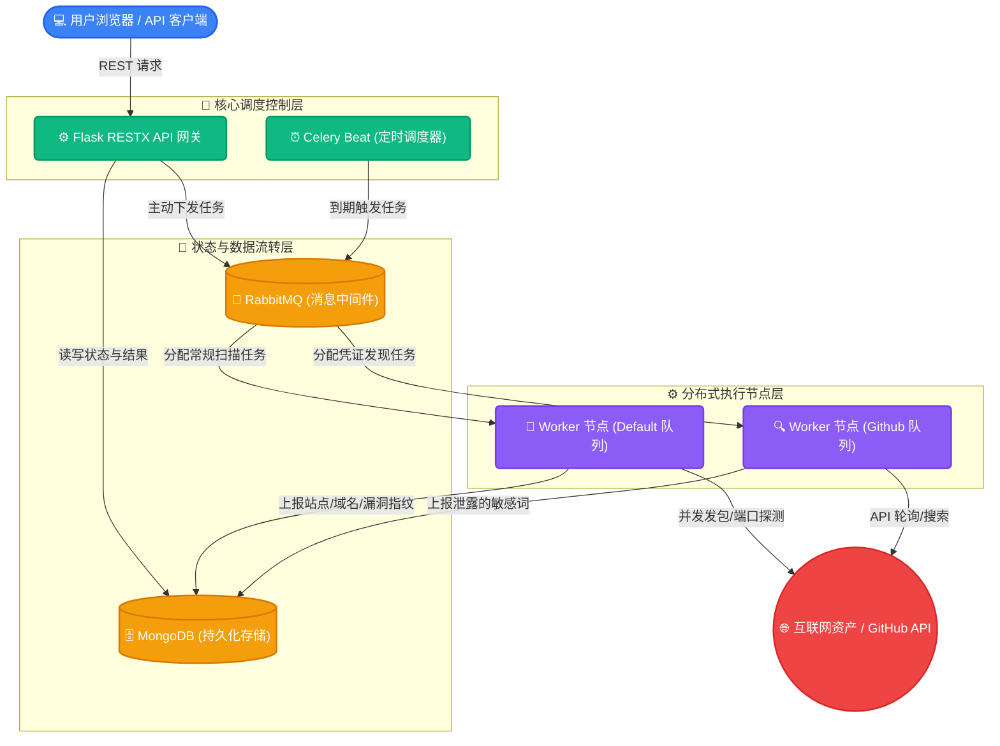
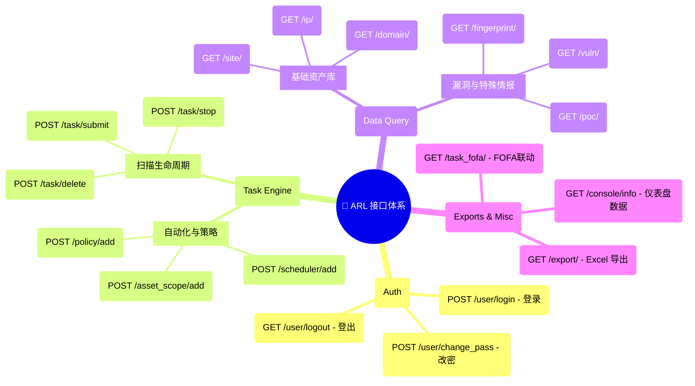
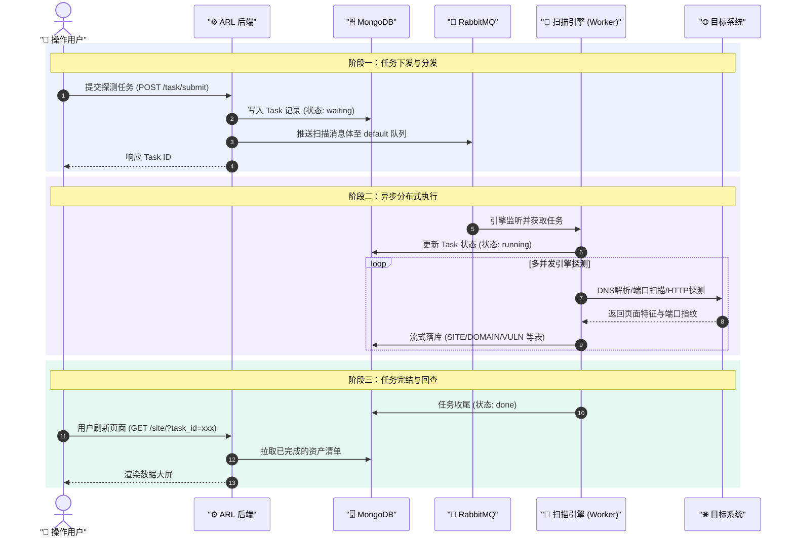
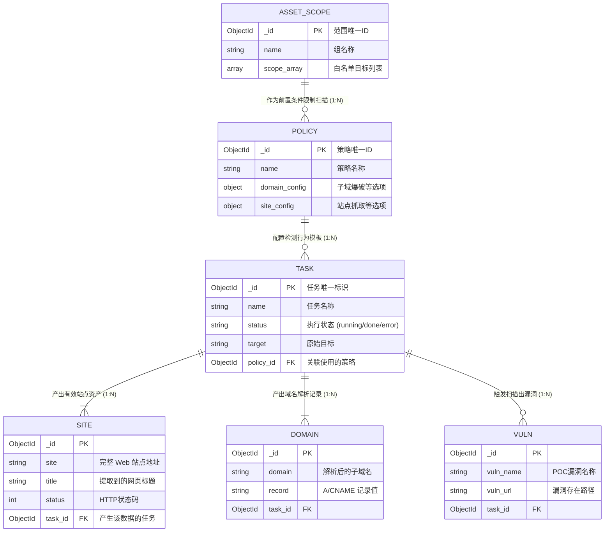
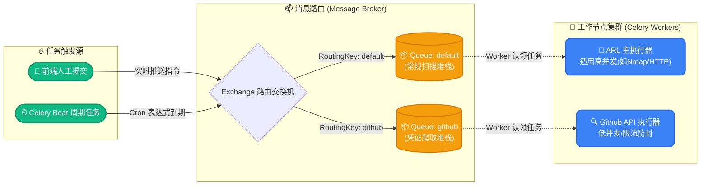

# ARL-PRO 架构设计图册 (优化版)

以下是对 ARL-PRO 系统的架构与设计流程的深度可视化。新版架构图引入了分组、色彩视觉区分以及清晰的数据流向，使得逻辑更直观、更易读。

---

## 1. 系统核心拓扑图 (System Topology)
采用**颜色区分组件职责**，明确展示控制层（API）、数据流转层（队列/数据库）和执行层（Workers）之间的关系。

---

## 2. API 模块化全景图 (API Mindmap)
利用思维导图展示接口分类，使用 Emoji 进行**视觉锚点定位**，直观展示系统的四大基础骨架。

---

## 3. 标准任务流转时序图 (Task Sequence)
加入背景色区块划分，将任务拆解为**“触发下发”、“异步执行”、“闭环取回”**三个阶段。

---

## 4. 数据库实体关系图 (ER Diagram)
明确了主键(PK)、外键(FK)的关系，以及核心集合（Collection）之间是一对多还是一对一。

---

## 5. Celery 异步队列调度图 (Celery Queues)
展示不同的任务触发方式是如何根据路由键（Route Key）分流到具有不同并发配置的隔离队列中，实现性能管控的。

